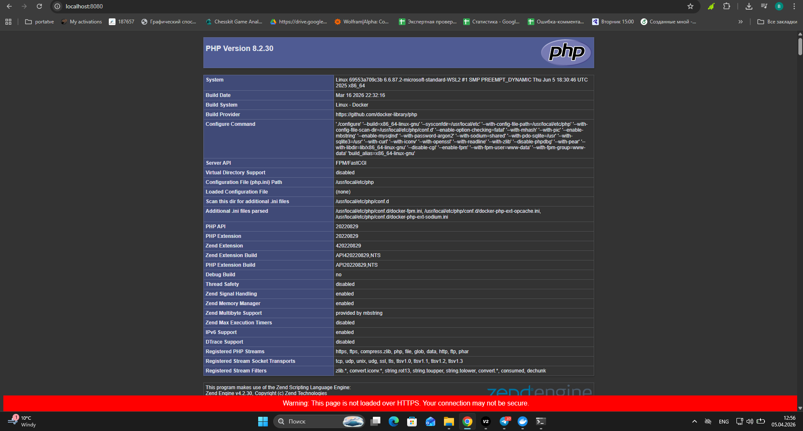
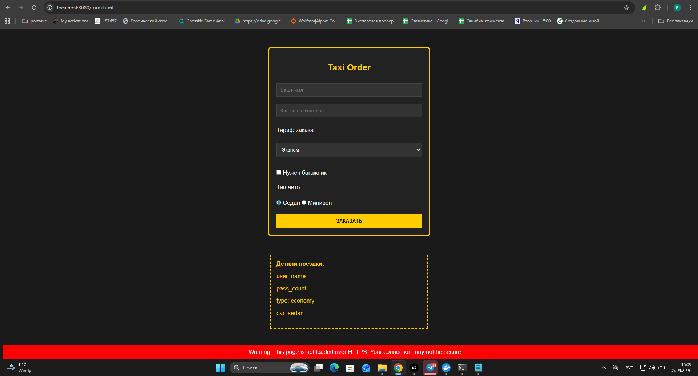

# Лабораторная работа №2: Настройка Nginx + PHP-FPM

**Выполнил:** Лащев Владислав
**Группа:** ПМ-ИП1
**Вариант:** 16 (Заказ такси)

## 📌 Описание
Настройка Nginx + PHP-FPM. Основы HTML-форм и обработка на JavaScript.

## 🛠 Что было сделано:
1. **Docker:**  В `docker-compose.yml` добавлен новый контейнер с PHP 
2. **Nginx:** Настроен конфиг в папке `nginx/`.
3. **PHP:** Сделан файл `index.php` для проверки связи контейнеров (phpinfo).
4. **Интерфейс:** Создана страница `form.html` с заказом такси.

## Штрафное задание:
- **Стили:** форма оформлена в темных тонах в стиле такси.
- **Анимация:** Форма плавно появляется при загрузке страницы (`fadeIn`).
- **Кнопка:** Добавлено `transition` и смену цвета при наведении курсора.
- **JS-контроль:** Реализован скрипт, который следит за активностью. Если не трогать страницу 15 секунд — появится уведомление.

## 📸 Скриншоты работы

## ✅ Итог
Задание выполнено полностью. Сервер обрабатывает PHP, данные из формы выводятся на экран
